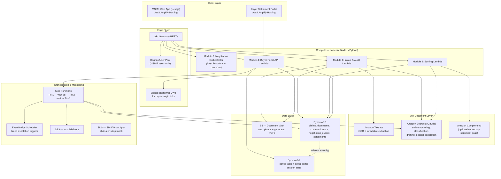
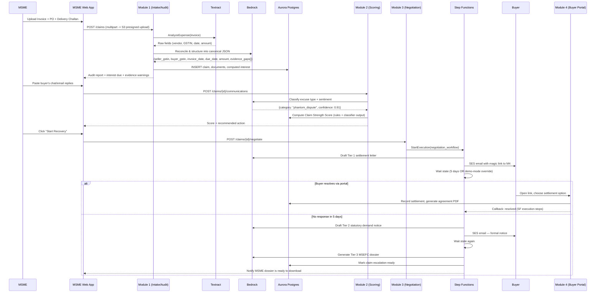

# VASULI — AWS-DEPLOYED MSME Delayed-Payment Recovery Platform
### The Team Bible | AWS Ship It Track | Architecture, Build Plan & Role Charter
**Hackathon track: Ship It — Deployed with a URL**
**Timeline: Hackathon build sprint | Team: 3 | Goal: Working AWS deployment + convincing 3-minute demo**

> Product name: **Vasuli**. Vasuli helps Indian MSMEs document delayed payments, assess claim strength, initiate structured recovery, and track settlement. This project is being built specifically for the AWS hackathon **Ship It** track, so AWS architecture, deployment, cost awareness, and a public working URL are first-class deliverables.

---

## 0. Non-Negotiables — Ship It Track

1. **AWS is mandatory and central.** The deployed application must use AWS services meaningfully, not merely mention AWS in the README.
2. **One AWS account and one region:** use `ap-south-1` (Mumbai) unless the team explicitly documents another region. All deployed resources must be tracked in the repository.
3. **A public URL is a required deliverable.** The final submission must include a working HTTPS URL, a short demo account or safe demo flow, and deployment instructions.
4. **Use the simplest AWS architecture that can be deployed reliably during the hackathon.** Prefer Lambda, API Gateway, S3, DynamoDB, Amazon Bedrock, and Amplify Hosting. Avoid Aurora, ECS, EKS, or complex networking unless the team has already proven the deployment.
5. **No secrets in Git.** Use environment variables, AWS Secrets Manager, SSM Parameter Store, or the hosting platform's secret configuration. Never commit AWS access keys, API keys, tokens, or `.env` files.
6. **Use AWS CDK or SAM for repeatable infrastructure.** Do not rely on undocumented manual console changes. If a console step is unavoidable, record it in `DEPLOYMENT.md`.
7. **Every AWS-backed feature needs a local fallback or seeded demo state** so the final video does not fail because of network, quota, model, or email issues.
8. **Mock legally or technically unavailable integrations** such as live GSTN verification, real buyer companies, real payment collection, WhatsApp Business API, or MSEFC filing. Clearly label mocks in the UI and README.
9. **Build one end-to-end vertical slice first:** upload/choose a claim → extract and structure data → assess claim → generate recovery communication → show status in the dashboard.
10. **Every feature must have a demo path, an owner, and a documented AWS service dependency.**


## 1. System Architecture

### 1.1 Actors
- **MSME Owner (Claimant)** — logs into the SETU web app, uploads documents, tracks claims.
- **Buyer (Debtor)** — never logs in with a password; receives a unique tokenized link (Module 4).
- **SETU System** — the automated agent (document audit, scoring, negotiation drafting, escalation).

### 1.2 High-Level AWS Component Diagram



### 1.3 AWS Services and Why We Use Them

| Layer | Service | Why this and not the alternative |
|---|---|---|
| Frontend hosting | S3 + CloudFront | Static SPA hosting, free-tier friendly, instant global CDN, zero server ops for a 2.5-day build. Two separate CloudFront distributions (MSME app, Buyer portal) since they have different auth models. |
| Auth (MSME side) | Cognito User Pool | Native API Gateway authorizer integration; no custom JWT signing code to debug under time pressure. |
| Auth (Buyer side) | Signed, short-TTL JWT embedded in the magic link (NOT Cognito) | Buyers must never "sign up." A link like `https://settle.setu.app/c/<token>` where token is a signed claim reference is the correct pattern — matches how real payment-link products (Razorpay Payment Links, Stripe Checkout) work. |
| API | API Gateway (REST, not HTTP API) | REST API gives you request validation + usage plans out of the box; worth the extra 10 minutes of setup to stop malformed payloads from reaching Lambda. |
| Compute | Lambda | No server management, pay-per-invoke, scales to zero — ideal when 3 of 4 people are writing business logic, not infra. |
| Document extraction | Amazon Textract (`AnalyzeExpense` + `AnalyzeDocument` Forms/Tables) | `AnalyzeExpense` is purpose-built for invoices — returns vendor, invoice date, totals, line items as structured fields out of the box. This is a massive shortcut over building your own extraction prompts for a 2.5-day build. |
| Reasoning / drafting / classification | Amazon Bedrock — **Claude (Sonnet class)** | One model, four jobs: (a) structuring Textract's raw output into your JSON schema when Textract's confidence is low, (b) classifying buyer excuses (deflection / phantom dispute / liquidity crisis), (c) drafting Tier 1/2/3 letters in the right legal register, (d) generating the MSEFC dossier narrative. Use a single well-versioned prompt library (Section 3.5) so all three people call the model the same way. |
| Structured data | Amazon DynamoDB | Fastest hackathon-friendly managed database; use single-table or a small number of clearly separated tables with claim ID as the main access pattern. Avoid database server provisioning and networking complexity. |
| Session / ephemeral state | DynamoDB | Buyer portal session state (has the buyer viewed the link, which option are they mid-selecting) and the global config table (bank rate, escalation day thresholds) — both are single-key lookups, DynamoDB's sweet spot. |
| Document storage | S3 (private bucket, SSE-S3 encryption) | Raw uploads, generated settlement PDFs, generated MSEFC dossiers. Serve via presigned URLs only — never public. |
| Orchestration | Step Functions (Standard workflow) + EventBridge Scheduler | Module 3's "wait 5 days, then escalate" is a textbook Step Functions `Wait` state pattern. Do **not** build this with a cron-polling Lambda — Step Functions gives you a visual execution history, which doubles as your live demo proof that Tier 1 → Tier 2 → Tier 3 actually executed. |
| Email | SES (sandbox mode is fine for a hackathon — verify your own test buyer email addresses) | Sends Tier 1/2/3 letters and the buyer portal magic link. |
| IaC | AWS SAM or AWS CDK | Use SAM if speed and Lambda deployment simplicity matter most; use CDK if the team is already comfortable with TypeScript infrastructure. Choose one and document the decision. |

### 1.4 Data Flow — One Claim, Start to Finish



---

## 2. Data Model (freeze this by Hour 6)

### 2.1 Aurora PostgreSQL — core schema

```
sellers            (id, business_name, gstin, udyam_registration_no, email, phone)
buyers             (id, business_name, gstin, email, phone)
claims             (id, seller_id, buyer_id, status, principal_amount, invoice_date,
                    agreed_credit_days DEFAULT 45, due_date, days_overdue,
                    interest_accrued, claim_strength_score, created_at, updated_at)
documents          (id, claim_id, type ENUM[invoice, po, delivery_challan, chat_screenshot],
                    s3_key, extraction_status, extracted_json, evidence_gap_flags[])
communications     (id, claim_id, source ENUM[buyer, seller], raw_text, channel,
                    classified_category, sentiment_score, logged_at)
negotiation_events (id, claim_id, tier INT, action, letter_s3_key, sent_at,
                    step_function_execution_arn, buyer_responded_at)
settlements        (id, claim_id, option ENUM[lump_sum, emi], agreed_amount,
                    emi_schedule_json, agreement_s3_key, accepted_at)
audit_log          (id, claim_id, actor, event, payload_json, created_at)
```

**Why this shape:** every module reads/writes exactly one or two tables — Module 1 owns `documents` + writes `claims`, Module 2 owns `communications` + updates `claims.claim_strength_score`, Module 3 owns `negotiation_events`, Module 4 owns `settlements`. This is what lets 4 people work in parallel without stepping on each other's migrations.

### 2.2 DynamoDB tables

```
config_table        PK: config_key         (e.g. "BANK_RATE", "TIER1_WAIT_DAYS")
buyer_session_state  PK: claim_token        (buyer portal ephemeral state, TTL enabled)
```

### 2.3 S3 bucket layout

```
s3://setu-documents/
  raw-uploads/{claim_id}/{document_id}.pdf
  generated-letters/{claim_id}/tier1.pdf
  generated-letters/{claim_id}/tier2.pdf
  dossiers/{claim_id}/msefc_dossier.pdf
  settlements/{claim_id}/agreement.pdf
```

---

## 3. Where Every Piece of Data Comes From (this is the part teams skip and regret)

| Data needed | Real or Synthetic? | Where to get it / how to generate it |
|---|---|---|
| **MSMED Act, 2006 — Sections 15 & 16 text** | Real, public | Ministry of MSME / India Code (indiacode.nic.in) — copy the exact statutory clauses once into a `legal_reference.json` config used by the Bedrock prompt for Tier 2/3 drafting. Don't paraphrase this from memory into legal-sounding demo copy — get the actual section text so the notice reads authentically. |
| **RBI Bank Rate (for the 3x compound interest calc)** | Real, changes periodically | rbi.org.in "Current Rates" page. As of Sept 2026 it is **5.50%**. Store as `BANK_RATE` in `config_table`, multiply by 3 per Section 16, document the source + retrieval date in a code comment. Do not call a live RBI API — none exists publicly; this is a manually-updated config value by design. |
| **GSTIN format validation** | Real (algorithmic), no live lookup | GSTIN has a public, documented 15-character format + checksum algorithm. Implement local regex + checksum validation. **Do not** attempt live GSTN portal verification — it requires authenticated B2B API access you won't get in 2.5 days. State this explicitly as a "V2 roadmap: live GSTN verification" line in your pitch — judges respect an honest scope cut far more than a fake API call. |
| **Sample invoices / POs / delivery challans (for demo + Textract testing)** | Synthetic, generated by you | Use Bedrock/Claude or a simple HTML→PDF template to generate 8–10 realistic-looking Indian tax invoices (GSTIN, HSN codes, itemized billing, invoice date, PO reference) at varying "quality" (one missing a signature, one missing a delivery challan entirely) so you can demo the Evidentiary Weakness Warning convincingly. Keep company names obviously fictional ("Bharat Precision Components Pvt Ltd") — never use a real company's identity in a demo dataset. |
| **WhatsApp/email stalling replies (for Module 2 classifier demo)** | Synthetic, generated by you | Write ~15 example buyer replies covering the three categories (deflection, phantom dispute, liquidity crisis) yourselves — these become your Bedrock classification prompt's few-shot examples *and* your demo script inputs. This is the single highest-leverage synthetic dataset in the whole project; spend real time getting these realistic. |
| **Buyer/company test identities** | Synthetic | Faker-generated Indian business names, addresses, phone numbers. Never scrape real MCA/GST public records for demo data even though it's technically public — optics matter to judges and it's an unnecessary risk. |
| **RBI holiday calendar (for accurate day-counting on the 45-day clock)** | Real, static for the year | RBI publishes a bank holiday list annually — hardcode the current year's list as a JSON array; this only needs updating once a year. |
| **Claim Strength Score weights** | Your own derived logic, not "real" data | This is a rules-engine you design: e.g. `score = 40*(paperwork_completeness) + 35*(1 - min(days_overdue/180,1)) + 25*(communication_signal)`. Document your weights and reasoning in a `SCORING_MODEL.md` — judges will ask "how did you get this number," and "we made it up" is a worse answer than a documented, defensible heuristic. |
| **Payment gateway for buyer portal** | Simulated | Do **not** integrate a real payment gateway. Build the "Accept Settlement" button to write a `settlements` row and generate a PDF agreement — that's the actual deliverable (a binding acknowledgment), not the money movement. If you want a stretch-goal visual, use Razorpay's test-mode Payment Links (no real money, no compliance burden) — optional, not core path. |

---

## 4. Phase-Wise, Feature-Wise Build Plan (60 hours)

Times are elapsed hours from kickoff. Build **vertically** — get one claim moving through all 4 modules end-to-end early, even if ugly, then harden each module.

### Phase 0 — Foundation (Hour 0 → 6) — ALL 3 PEOPLE TOGETHER
- [ ] Finalize this doc's data model — no silent edits after this phase.
- [ ] Create AWS account/IAM users, CDK bootstrap, one shared GitHub repo, branch strategy (`main` protected, feature branches, PR review before merge — even under time pressure, a 2-minute review catches schema drift).
- [ ] Stand up Aurora Postgres (Serverless v2, min capacity) + run the schema migration from Section 2.1.
- [ ] Stand up the two DynamoDB tables and seed `config_table` with `BANK_RATE=5.50`, `TIER1_WAIT_DAYS=5`, `TIER2_WAIT_DAYS=5`.
- [ ] Create the S3 document bucket with the folder convention from Section 2.3.
- [ ] Stand up API Gateway with empty route stubs for all 4 modules so every person can start hitting a real (if empty) endpoint immediately.
- [ ] Generate the synthetic dataset (Section 3): 8–10 invoices/POs/challans, 15 buyer-reply examples, 5 fictional buyer/seller identities. **Assign this to whoever finishes infra setup first — don't let it slip to Hour 40.**
- [ ] Write and freeze `legal_reference.json` (Section 15/16 text) and `SCORING_MODEL.md` (weights + reasoning).

### Phase 1 — Core Module Build (Hour 6 → 30) — PARALLEL, PER-PERSON OWNERSHIP
See Section 5 for exact per-person breakdown. Target: by Hour 30, one claim can go from "upload PDF" → "audit report with interest calculated" → "strength score" → "Tier 1 letter drafted and emailed" → "buyer portal link opens and shows the claim" — even if Tier 2/3 and the polish aren't there yet. **This is your vertical slice checkpoint. If it's not working by Hour 30, stop new features and fix the pipe.**

### Phase 2 — Full Feature Depth + Orchestration (Hour 30 → 44)
- [ ] Step Functions wiring for the full Tier 1 → wait → Tier 2 → wait → Tier 3 flow, with a **demo-mode override** (env flag that shrinks "5 days" to "30 seconds") — you cannot demo a 5-day wait live, build the time-compression switch now, not at Hour 55.
- [ ] Evidentiary Weakness Warning fully wired into the Module 1 report UI.
- [ ] EMI settlement option (3-installment schedule generation + display) in Module 4.
- [ ] MSEFC dossier PDF generation (Tier 3) — this is a big visual "wow" moment for judges; don't shortcut its formatting.
- [ ] Cross-module integration testing — one person runs the *entire* flow start to finish, logs every break.

### Phase 3 — Hardening, Polish, Demo Prep (Hour 44 → 56)
- [ ] Error states: bad PDF upload, Textract low-confidence extraction, buyer link expired — handle all three gracefully in UI, don't let the demo hit a raw stack trace.
- [ ] Seed 3 pre-baked demo claims at different stages (fresh audit / mid-negotiation / settled) so the demo doesn't depend on live processing time.
- [ ] UI pass on both apps — this is a judged hackathon, visual polish is not optional. Assign explicitly (Section 5).
- [ ] Record a 90-second backup demo video in case live Wi-Fi fails during judging — **always have this.**
- [ ] Pitch deck: problem (₹10.7L Cr framing), architecture diagram (reuse Section 1.2), live demo script, honest "what we'd build next" slide (GSTN live verification, real payment gateway, WhatsApp Business API integration).

### Phase 4 — Buffer & Dress Rehearsal (Hour 56 → 60)
- [ ] Full dry-run demo, timed, in front of the whole team.
- [ ] Fix only demo-breaking bugs. **No new features after Hour 56.**
- [ ] Confirm AWS costs are within control (check Cost Explorer — Aurora Serverless v2 and Bedrock are your two spend risks; scale Aurora ACU down when not actively demoing).

---

## 5. Team of 3 — Ownership Charter

### Person A — Frontend, UX and Demo Experience
- Owns the MSME dashboard, claim intake screens, claim detail page, assessment view, recovery timeline, loading/error states, responsive design, and final UI polish.
- Uses Next.js + TypeScript and deploys through AWS Amplify Hosting.
- Integrates with API Gateway endpoints but does not change backend contracts without documenting the change.
- Deliverable: a polished user journey that works with seeded demo data and real API responses.

### Person B — AI, Documents and Claim Assessment
- Owns Module 1 and Module 2 AI logic.
- Builds S3 document upload flow, Amazon Textract extraction where useful, Amazon Bedrock prompts, structured claim JSON, evidence-gap warnings, buyer-reply classification, and claim-strength scoring.
- Uses mocked or seeded inputs whenever AWS service quotas or credentials are unavailable.
- Deliverable: upload/select a claim → obtain structured fields → produce an explainable assessment and evidence warnings.

### Person C — AWS Infrastructure, APIs and Integration
- Owns API Gateway, Lambda functions, DynamoDB, S3 buckets, IAM permissions, Bedrock/Textract configuration, deployment automation, environment variables, monitoring, and the public URL.
- Builds Module 3 recovery orchestration using Step Functions only if it can be deployed reliably; otherwise implement a simpler Lambda-driven state machine with a clearly documented demo-mode timer.
- Owns integration testing, `DEPLOYMENT.md`, AWS cost checks, and final deployment.
- Deliverable: one command or documented workflow deploys the application and APIs to AWS, with a working public URL.

### Shared Responsibilities
- Freeze API contracts and DynamoDB item shapes early.
- Keep `PROJECT.md`, `README.md`, `DEPLOYMENT.md`, `SCORING_MODEL.md`, and `.env.example` updated.
- Use seeded demo claims so the three-minute video is deterministic.
- Review one another's changes before merging.
- Record what was learned about AWS in the final project write-up.

## 6. Judge-Facing Talking Points (bake these into the pitch, don't improvise them)

- **Legal grounding, not vibes:** every number the system produces (interest due, deadline, deemed-acceptance cutoff) traces to a specific MSMED Act section, shown in the UI as a citation, not asserted by an LLM in free text.
- **Relationship-preserving by design:** Tier 1 is deliberately non-hostile — this is the product's core insight (Module 3's ordering is the whole thesis: escalation is a last resort, not a first move), and it directly answers the stated problem of MSMEs fearing to burn bridges.
- **Honest scope boundaries:** name the three things you deliberately did not build in 2.5 days (live GSTN verification, live payment gateway, WhatsApp Business API) and why — this reads as engineering maturity, not weakness.
- **Everything traces to a real statutory or documented source** — the RBI bank rate, the Act's section text, the deemed-acceptance timeline — nothing in the legal-facing output is invented by an LLM without a grounding source behind it.

---


## 17. Ship It Submission Checklist

- [ ] Application deployed on AWS.
- [ ] Public HTTPS URL tested from an incognito browser.
- [ ] AWS services are visible in the architecture diagram and explained in the README.
- [ ] At least one meaningful feature uses Amazon Bedrock, Textract, Lambda, API Gateway, DynamoDB, S3, or another approved AWS service.
- [ ] Deployment instructions work from a clean machine.
- [ ] No secrets, credentials, or private customer documents are committed.
- [ ] Demo mode and seeded claims are available.
- [ ] Three-minute video clearly explains: problem, users, workflow, AWS role, and measurable impact.
- [ ] AWS cost and resource cleanup plan documented.
- [ ] Final README includes the deployed URL, architecture diagram, setup steps, limitations, and future scope.

*End of bible. If a decision isn't in this document, it needs a 2-line team Slack post before it becomes code — not a solo call at 3 AM.*
