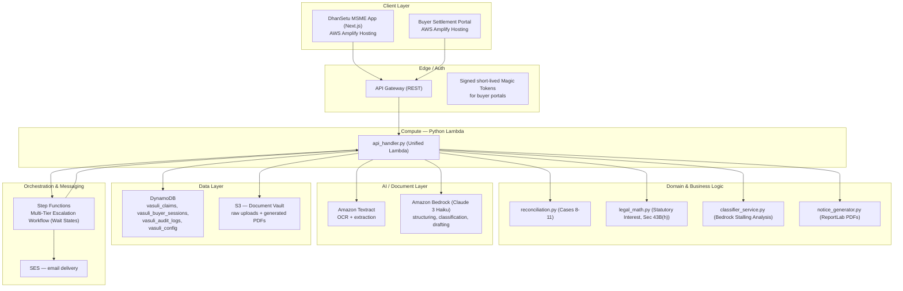

# DHANSETU (formerly Vasuli) — AWS-DEPLOYED MSME Delayed-Payment Recovery Platform
### The Team Bible | AWS Ship It Track | Architecture, Build Plan & Role Charter
**Hackathon track: Ship It — Deployed with a URL**
**Timeline: Hackathon build sprint | Team: 3 | Goal: Working AWS deployment + convincing 3-minute demo**

> Product name: **DhanSetu**. DhanSetu helps Indian MSMEs document delayed payments, assess claim strength, initiate structured recovery, and track settlement. This project is being built specifically for the AWS hackathon **Ship It** track, so AWS architecture, deployment, cost awareness, and a public working URL are first-class deliverables.

---

## 0. Non-Negotiables — Ship It Track

1. **AWS is mandatory and central.** The deployed application uses AWS services meaningfully.
2. **One AWS account and one region:** `ap-south-1` (Mumbai). All deployed resources tracked in the repository.
3. **A public URL is a required deliverable.** The final submission includes a working HTTPS URL, demo flow, and deployment instructions.
4. **Simplest AWS architecture deployed reliably:** Lambda, API Gateway, S3, DynamoDB, Amazon Bedrock, and Amplify Hosting.
5. **No secrets in Git.** Environment variables used strictly.
6. **Use AWS CDK for repeatable infrastructure.**
7. **Every AWS-backed feature needs a local fallback.** `DEMO_MODE=true` ensures offline testability.
8. **Mock legally or technically unavailable integrations** (e.g., live GSTN verification).
9. **Build one end-to-end vertical slice first.** Upload → extract → reconcile → assess → calculate statutory math → generate recovery communication → track.

## 1. System Architecture (Unified Python Serverless)

DhanSetu natively operates on a **Unified Serverless Python Architecture**. The Node.js implementation located in `src/person-b` serves only as an integration reference standard; the production environment runs entirely on Python via AWS Lambda.

### 1.1 Actors
- **MSME Owner (Claimant)** — logs into the DhanSetu web app, uploads documents, tracks claims.
- **Buyer (Debtor)** — never logs in with a password; receives a unique tokenized magic link.
- **DhanSetu System** — the automated agent (document audit, commercial reconciliation, statutory math, scoring, negotiation drafting, escalation).

### 1.2 High-Level AWS Component Diagram



### 1.3 AWS Services and Why We Use Them

| Layer | Service | Purpose |
|---|---|---|
| Frontend hosting | S3 + CloudFront (Amplify) | Fast SPA hosting. |
| Auth (Buyer side) | Magic Link Tokens | Buyers must never "sign up". Embedded short-TTL tokens map directly to DynamoDB sessions. |
| API | API Gateway (REST) | Fast AWS routing mapped to Lambda. |
| Compute | Lambda (Python 3.12) | Highly scalable serverless logic wrapper for the business functions. |
| Document extraction | Amazon Textract | Raw structured fields from complex invoices/documents. |
| Reasoning & AI | Amazon Bedrock (Claude 3 Haiku) | Categorizes buyer excuses (deflection, liquidity) and parses unstructured text. |
| Structured data | Amazon DynamoDB | Fast schema-less data storage for claims and short-lived buyer sessions. |
| Document storage | S3 (Private Bucket) | Storage for uploaded invoices and ReportLab generated PDFs (Notices, Dossiers). |
| Orchestration | Step Functions | Explicit state-machine execution for "Wait 5 Days" escalation between Tier 1, Tier 2, and Tier 3 notices. |
| Email | SES | Rapid email dispatch of statutory letters. |

*(Note: Features previously planned, such as Amazon Comprehend and EventBridge Scheduler, were replaced natively by Claude 3 via Bedrock and Step Functions Wait states respectively).*

---

## 2. API Endpoints (Traced from AWS Lambda)

The central server handles all business logic dynamically through `backend/lambda/api_handler.py`.

| Method | Endpoint | Description |
|---|---|---|
| GET | `/` | System Health Check |
| POST | `/claims` | Claim Intake and basic persistence |
| POST | `/claims/{claim_id}/audit` | Runs Cases 8-11 Commercial Reconciliation + MSMED Sec 16 Interest Engine |
| POST | `/claims/{claim_id}/classify-excuse` | Invokes Bedrock to analyze the exact buyer stalling tactics |
| POST | `/claims/{claim_id}/start-recovery` | Triggers a fresh magic link token creation for the buyer |
| GET | `/claims/{claim_id}/notices/{tier}/pdf` | Generates Tier 1 or Tier 2 Statutory PDFs on-the-fly |
| GET | `/claims/{claim_id}/dossier/pdf` | Generates the complete Tier 3 MSEFC Filing Dossier |
| POST | `/claims/{claim_id}/dispatch` | Multi-channel communication dispatch (triggers SES, WhatsApp deep-link, Step Functions) |
| GET | `/resolve/{claim_id}` (or `/buyer/portal/{token}`) | Read-only claim snapshot specifically formatted for the Buyer Settlement Portal |
| POST | `/resolve/{claim_id}` | Accepts a buyer's settlement (5% discount or EMI plan) and executes the PDF Deed |
| GET | `/telemetry/logs` | Fetches live AWS CloudWatch operational event logs for the frontend |

---

## 3. Real-World Statutory & Operational Edge Cases

DhanSetu explicitly maps and protects against the 24 most complex MSME recovery realities in India.

### Category 1: Ingestion & Ground-Level Anomalies (Frontend `/intake`)
* **Katoti (Vernacular Deductions):** Capturing unspoken deductions natively on the intake form.
* **Bilty/Lorry Receipt Fallbacks:** Used when formalized Delivery Challans are missing.
* **Dual Invoice Dates & Math Checksums.**

### Category 2: Accounting & Commercial Reconciliation (Backend `reconciliation.py`)
* **Case 8 (FIFO):** Maps unassigned payments chronologically.
* **Case 9 (Verified Deductions):** Filters out unverified arbitrary retentions.
* **Case 10 (Retention Money / DLP):** Excludes legitimately retained DLP funds from penalty structures.
* **Case 11 (Job-Work Scrap):** Flags missing material variances strictly.

### Category 3–5: Statutory Legal Protections (Backend `legal_math.py` & `classifier_service.py`)
* **Silpi Industries Precedent (Udyam Trap):** Verifies the seller held Udyam registration *prior* to supply.
* **Wholesale/Retail Exclusion:** Disables MSMED Chapter V privileges for NIC 45/46/47 traders.
* **Section 43B(h) Corporate Tax Penalty:** Computes exact 30% fiscal disallowance liabilities.
* **Gurpreet Singh v. UOI (Appropriation):** Forces incoming buyer payments to clear interest before principal, irrespective of buyer remarks.
* **Latent vs Patent Defects:** Triggers Section 15 Proviso (15-day deemed acceptance bar) on superficial defects, bypassing stalling.

---

## 4. Data Model

### DynamoDB Core Tables
```
vasuli_claims        PK: claim_id           (Primary state machine)
vasuli_buyer_sessions PK: claim_token        (Buyer portal ephemeral state)
vasuli_config        PK: config_key         (e.g., BANK_RATE)
vasuli_audit_logs    PK: log_id
```

### S3 bucket layout
```
s3://vasuli-docs-{account}-{region}/
  raw-uploads/{claim_id}/{document_id}.pdf
  generated-letters/{claim_id}/tier1.pdf
  generated-letters/{claim_id}/tier2.pdf
  dossiers/{claim_id}/msefc_dossier.pdf
  settlements/{claim_id}/binding_settlement_agreement.pdf
```

## 5. Development Roles Summary

- **Person A (Frontend)**: Next.js App Router, Framer Motion, Category 1 Intake Edge Cases.
- **Person B (AI & Reconciliation)**: Bedrock prompting, Explainable 0-100 Claim Strength Scoring, Commercial Reconciliation Engine (Cases 8-11).
- **Person C (AWS & Infra)**: CDK Deployment, Unified API Handler, ReportLab Notice Engines, Statutory Math Engine, Multi-channel dispatch.

*End of bible.*
